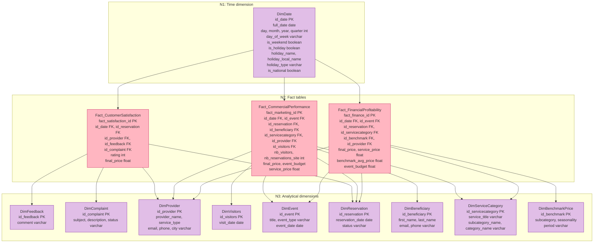
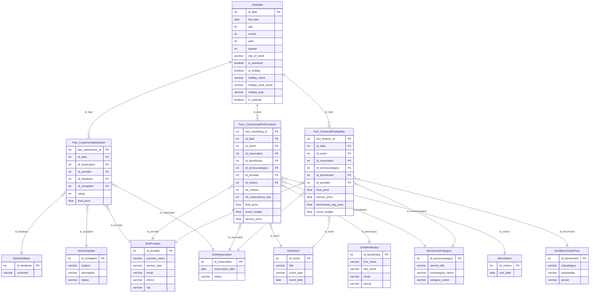

# EventZilla Data Warehouse — 3-Level Star Model

Modelling aligned with **Diagramme_BI_EventZella_3Niveaux** (PlantUML).  
**N1** = Time dimension · **N2** = Fact tables (raw measures) · **N3** = Analytical dimensions.  
KPIs are calculated in the BI layer, not in the DWH.

**Tools:**
- **dbdiagram.io**: [https://dbdiagram.io/d](https://dbdiagram.io/d) → Import → DBML → paste `EventZilla_DWH_Model.dbml`
- **Mermaid**: copy the block below into [https://mermaid.live](https://mermaid.live)

---

## Complete Mermaid schema with colours (detailed flowchart)

**Facts = pink** · **Dimensions = purple**. Full diagram with column details. Copy this block into [mermaid.live](https://mermaid.live).

---

## Mermaid ER schema — same detail, ER syntax

Same columns as above in ER format. ER diagrams do not support fact/dimension colours; use the detailed flowchart above for colours.

---

## Legend (aligned with PlantUML)

| Level | Type | Tables |
|--------|------|--------|
| **N1** | Time dimension | DimDate (merged with external_holidays.csv) |
| **N2** | Fact tables | Fact_CustomerSatisfaction, Fact_CommercialPerformance, Fact_FinancialProfitability |
| **N3** | Analytical dimensions | DimFeedback, DimComplaint, DimProvider, DimVisitors, DimEvent, DimReservation, DimBeneficiary, DimServiceCategory, DimBenchmarkPrice |

**Raw measures (in fact tables only):**

| Fact | Measures | ETL source |
|------|----------|------------|
| Fact_CustomerSatisfaction | rating, final_price | DimFeedback, DimReservation |
| Fact_CommercialPerformance | nb_visitors, nb_reservations_site, final_price, event_budget, service_price | DimVisitors, DimReservation, DimEvent, DimServiceCategory |
| Fact_FinancialProfitability | final_price, service_price, benchmark_avg_price, event_budget | DimReservation, DimServiceCategory, DimBenchmarkPrice, DimEvent |

**KPIs (calculated in BI, not in DWH):** Conversion rate, Average basket, Total revenue, Average rating, Resolution rate, Share below/aligned/above market, Holiday impact on revenue, Commission rate, etc.

**Data sources:** DimDate ← Dates + external_holidays.csv · DimFeedback ← EVALUATION · DimVisitors ← VISITORS · DimEvent ← EVENT · DimReservation ← RESERVATION · DimServiceCategory ← SERVICE/SUBCAT/CAT · DimBenchmarkPrice ← benchmark CSV
