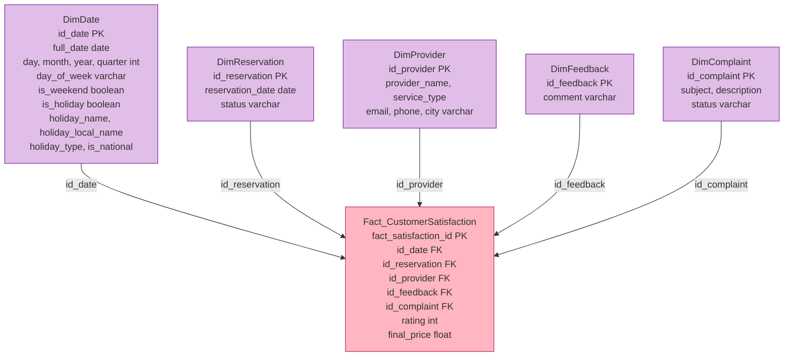
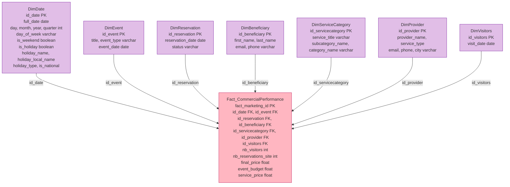
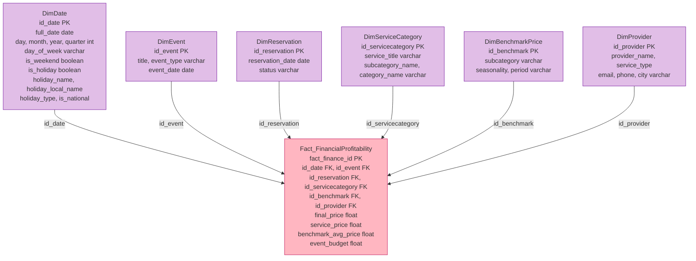

# EventZilla DWH — Per–fact visualization (Mermaid, detailed)

Each block below is a **full diagram**: one fact table and all its dimensions with **column details**.  
**Facts = pink** · **Dimensions = purple**.  
Copy a block into [https://mermaid.live](https://mermaid.live).

---

## Block 1 — Fact_CustomerSatisfaction (full detail)

**Raw measures:** `rating`, `final_price`.

---

## Block 2 — Fact_CommercialPerformance (full detail)

**Raw measures:** `nb_visitors`, `nb_reservations_site`, `final_price`, `event_budget`, `service_price`.

---

## Block 3 — Fact_FinancialProfitability (full detail)

**Raw measures:** `final_price`, `service_price`, `benchmark_avg_price`, `event_budget`.

---

## Relationship summary

| Fact | Keys to dimensions |
|------|--------------------|
| **Fact_CustomerSatisfaction** | id_date → DimDate · id_reservation → DimReservation · id_provider → DimProvider · id_feedback → DimFeedback · id_complaint → DimComplaint |
| **Fact_CommercialPerformance** | id_date → DimDate · id_event → DimEvent · id_reservation → DimReservation · id_beneficiary → DimBeneficiary · id_servicecategory → DimServiceCategory · id_provider → DimProvider · id_visitors → DimVisitors |
| **Fact_FinancialProfitability** | id_date → DimDate · id_event → DimEvent · id_reservation → DimReservation · id_servicecategory → DimServiceCategory · id_benchmark → DimBenchmarkPrice · id_provider → DimProvider |

**Colour legend:** Fact tables = **pink** (#FFB6C1) · Dimensions = **purple** (#E1BEE7).
